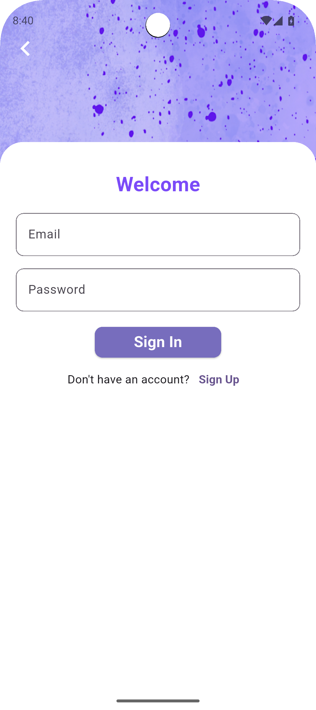
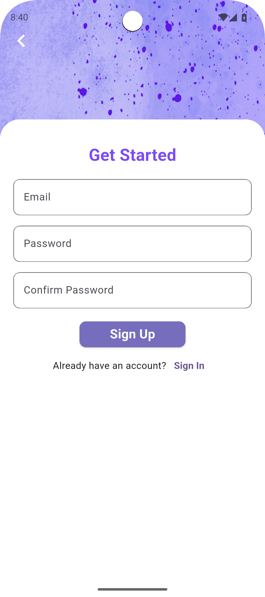

# Assignment 10

## Overview
This repository contains the source code and screenshots for Assignment 10.

## Screenshots

Below are some screenshots demonstrating the app:

## How to Run
1. Clone the repository.
2. Open the project in your IDE.
3. Run the app on your preferred device or emulator.

## Author
Abrar Sami Nawshad